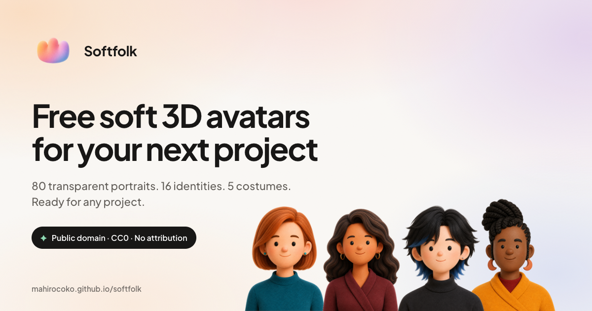

# Softfolk

[](https://mahirocoko.github.io/softfolk/)

Softfolk is a collection of 16 original soft 3D characters. Each one comes in five costumes—signature, everyday, work, formal, and yukata—for a total of 80 transparent 256×256 PNG portraits.

Use them in profiles, prototypes, mockups, or interfaces. **[Browse the collection →](https://mahirocoko.github.io/softfolk/)**

## Collection

| Identity | Signature | Everyday | Work | Formal | Yukata |
| --- | --- | --- | --- | --- | --- |
| Aster | [`signature`](assets/aster/signature.png) | [`everyday`](assets/aster/everyday.png) | [`work`](assets/aster/work.png) | [`formal`](assets/aster/formal.png) | [`yukata`](assets/aster/yukata.png) |
| Juno | [`signature`](assets/juno/signature.png) | [`everyday`](assets/juno/everyday.png) | [`work`](assets/juno/work.png) | [`formal`](assets/juno/formal.png) | [`yukata`](assets/juno/yukata.png) |
| Kai | [`signature`](assets/kai/signature.png) | [`everyday`](assets/kai/everyday.png) | [`work`](assets/kai/work.png) | [`formal`](assets/kai/formal.png) | [`yukata`](assets/kai/yukata.png) |
| Mira | [`signature`](assets/mira/signature.png) | [`everyday`](assets/mira/everyday.png) | [`work`](assets/mira/work.png) | [`formal`](assets/mira/formal.png) | [`yukata`](assets/mira/yukata.png) |
| Rowan | [`signature`](assets/rowan/signature.png) | [`everyday`](assets/rowan/everyday.png) | [`work`](assets/rowan/work.png) | [`formal`](assets/rowan/formal.png) | [`yukata`](assets/rowan/yukata.png) |
| Noa | [`signature`](assets/noa/signature.png) | [`everyday`](assets/noa/everyday.png) | [`work`](assets/noa/work.png) | [`formal`](assets/noa/formal.png) | [`yukata`](assets/noa/yukata.png) |
| Zuri | [`signature`](assets/zuri/signature.png) | [`everyday`](assets/zuri/everyday.png) | [`work`](assets/zuri/work.png) | [`formal`](assets/zuri/formal.png) | [`yukata`](assets/zuri/yukata.png) |
| Theo | [`signature`](assets/theo/signature.png) | [`everyday`](assets/theo/everyday.png) | [`work`](assets/theo/work.png) | [`formal`](assets/theo/formal.png) | [`yukata`](assets/theo/yukata.png) |
| Ines | [`signature`](assets/ines/signature.png) | [`everyday`](assets/ines/everyday.png) | [`work`](assets/ines/work.png) | [`formal`](assets/ines/formal.png) | [`yukata`](assets/ines/yukata.png) |
| Omar | [`signature`](assets/omar/signature.png) | [`everyday`](assets/omar/everyday.png) | [`work`](assets/omar/work.png) | [`formal`](assets/omar/formal.png) | [`yukata`](assets/omar/yukata.png) |
| Sora | [`signature`](assets/sora/signature.png) | [`everyday`](assets/sora/everyday.png) | [`work`](assets/sora/work.png) | [`formal`](assets/sora/formal.png) | [`yukata`](assets/sora/yukata.png) |
| Eden | [`signature`](assets/eden/signature.png) | [`everyday`](assets/eden/everyday.png) | [`work`](assets/eden/work.png) | [`formal`](assets/eden/formal.png) | [`yukata`](assets/eden/yukata.png) |
| Lumi | [`signature`](assets/lumi/signature.png) | [`everyday`](assets/lumi/everyday.png) | [`work`](assets/lumi/work.png) | [`formal`](assets/lumi/formal.png) | [`yukata`](assets/lumi/yukata.png) |
| Pax | [`signature`](assets/pax/signature.png) | [`everyday`](assets/pax/everyday.png) | [`work`](assets/pax/work.png) | [`formal`](assets/pax/formal.png) | [`yukata`](assets/pax/yukata.png) |
| Marlo | [`signature`](assets/marlo/signature.png) | [`everyday`](assets/marlo/everyday.png) | [`work`](assets/marlo/work.png) | [`formal`](assets/marlo/formal.png) | [`yukata`](assets/marlo/yukata.png) |
| Roux | [`signature`](assets/roux/signature.png) | [`everyday`](assets/roux/everyday.png) | [`work`](assets/roux/work.png) | [`formal`](assets/roux/formal.png) | [`yukata`](assets/roux/yukata.png) |

## Use an avatar

Portraits follow one path pattern:

```text
assets/<identity>/<costume>.png
```

For example:

```html

```

[`data/avatars.json`](data/avatars.json) lists every identity, costume path, and discovery tag if you want to build a picker or search the collection.

## Run the website locally

```text
pnpm install
pnpm dev
pnpm verify
```

`pnpm verify` runs the typecheck, tests, production build, and output checks.

## License

Softfolk is released under [CC0 1.0 Universal](LICENSE). You can use, modify, and share the avatars without asking permission or giving credit.
